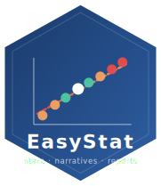

<<<<<<< HEAD
# EasyStat 

<!-- badges: start -->
[](https://CRAN.R-project.org/package=EasyStat)
[](https://github.com/itsmdivakaran/EasyStat/actions/workflows/R-CMD-check.yaml)
[](https://opensource.org/licenses/MIT)
[](https://EasyStat.github.io/EasyStat/)
<!-- badges: end -->

**Automated Statistical Analysis, Visualization, and Multi-Format Narrative Reporting in R**

> **Authors:** Mr. Mahesh Divakaran & Dr. Gunjan Singh (Amity School of Applied Sciences, Amity University Lucknow) — Prof. Dr. Jayadevan Shreedharan (Gulf Medical University)

---

## Overview

EasyStat bridges the gap between complex statistical output and actionable insight. A single function call delivers three outputs simultaneously: the statistical result, a plain-language narrative interpretation, and publication-ready tables — all rendered automatically in the RStudio Viewer (HTML), the R console (ASCII), or exported directly to Microsoft Word.

The core innovation is the **Narrative Generator Module**: conditional logic applied to p-values, effect sizes, and model-fit metrics produces statistically sound, human-readable explanations without any manual writing.

---

## Installation

```r
# From CRAN (when available)
install.packages("EasyStat")

# Development version from GitHub
# install.packages("devtools")
devtools::install_github("itsmdivakaran/EasyStat")

# From local source
install.packages("path/to/EasyStat", repos = NULL, type = "source")
```

---

## Quick Start

```r
library(EasyStat)

# Linear regression with narrative
easy_regression(mpg ~ wt + hp, data = mtcars)

# t-Test
easy_ttest(mpg ~ am, data = mtcars)

# One-way ANOVA
easy_anova(Sepal.Length ~ Species, data = iris)

# Descriptive statistics for multiple variables
easy_describe(mtcars, vars = c("mpg", "hp", "wt"))

# Correlation heatmap
easy_correlation_heatmap(mtcars, vars = c("mpg", "hp", "wt", "qsec", "drat"))

# Export any result to Word
result <- easy_regression(mpg ~ wt, data = mtcars)
export_to_word(result, file = "report.docx", title = "Fuel Economy Study",
               author = "Mahesh Divakaran, Gunjan Singh, Jayadevan Shreedharan")
```

---

## Four-Step Pipeline

| Step | Module | Role |
|------|--------|------|
| 1 | **Core Statistical Engine** | Wraps `lm()`, `t.test()`, `aov()`, `chisq.test()`, `var.test()`, `cor.test()` |
| 2 | **Metric Extractor** | Uses `broom::tidy()` / `broom::glance()` to extract p-values, effect sizes, CIs |
| 3 | **Narrative Generator Module** *(core invention)* | Applies conditional logic to produce plain-language explanations |
| 4 | **Unified Result Object** | Returns `easystat_result` S3 with tables, narrative, and optional plot |

---

## Function Reference

### Descriptive Statistics

| Function | Description |
|----------|-------------|
| `easy_describe()` | 21-statistic summary for one or more numeric variables |
| `easy_group_summary()` | Stratified descriptives by a grouping factor |

### Inferential Tests

| Function | Test | Effect Size |
|----------|------|-------------|
| `easy_regression()` | Linear regression (OLS) | R\u00b2, adjusted R\u00b2 |
| `easy_ttest()` | Independent / one-sample t-test | Cohen's d |
| `easy_anova()` | One-way ANOVA with post-hoc context | \u03b7\u00b2 (eta-squared) |
| `easy_chisq()` | Chi-square independence & GOF | Cram\u00e9r's V |
| `easy_ztest()` | One- and two-sample z-test | Cohen's d |
| `easy_ftest()` | F-test for equality of variances | Variance ratio + CI |
| `easy_correlation()` | Pearson / Spearman / Kendall correlation & matrix | r, r\u00b2 |

### Visualizations

| Function | Plot type |
|----------|-----------|
| `easy_histogram()` | Histogram with normal-curve overlay |
| `easy_boxplot()` | Grouped box-and-whisker plot |
| `easy_scatter()` | Scatter plot with regression line and R\u00b2 |
| `easy_barplot()` | Count or mean (\u00b1 SE) bar chart |
| `easy_qqplot()` | Q-Q normality plot |
| `easy_density()` | Kernel density curve, optionally grouped |
| `easy_correlation_heatmap()` | Annotated pairwise correlation heatmap |
| `easy_autoplot()` | Smart dispatcher — picks the right plot for a result |

### Theme & Export

| Function | Description |
|----------|-------------|
| `theme_easystat()` | Consistent ggplot2 theme for all plots |
| `export_to_word()` | Formatted `.docx` report (flextable + officer) |

---

## Output Modes

| Mode | Trigger |
|------|---------|
| **RStudio HTML Viewer** | Auto-detected in interactive sessions |
| **Console (ASCII)** | Scripts, terminals, non-interactive sessions |
| **Word (.docx)** | `export_to_word()` — one call, full report |

---

## Running the Smoke Test

```r
source(system.file("smoke_test.R", package = "EasyStat"))
```

Runs 25+ assertions across all analysis, visualization, and export functions.

---

## Citation

If you use EasyStat in your research, please cite:

> Divakaran M., Singh G., & Shreedharan J. (2026). *EasyStat: Automated
> Statistical Analysis, Visualization and Multi-Format Narrative Reporting
> in R* (Version 2.0.0). Amity University Lucknow & Gulf Medical University.
> <https://itsmdivakaran.github.io/Easystat/index.html>

---

## License

MIT \u00a9 2026 EasyStat Authors. See [LICENSE](LICENSE) for details.
=======
# Easystat
>>>>>>> d4ca618a4a9a9eac7a1d157ce7b46df34e598e08
