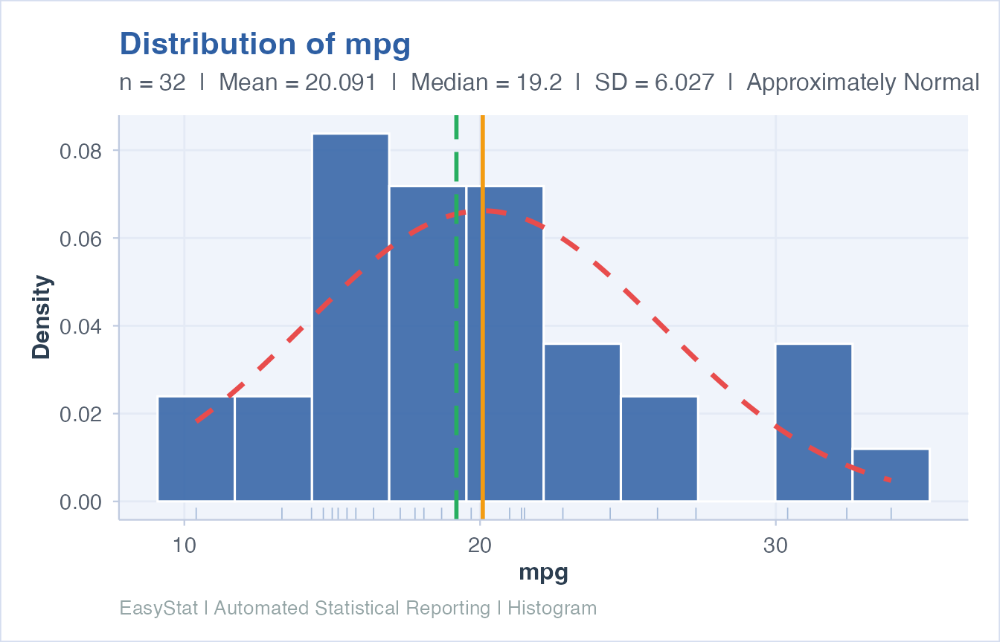
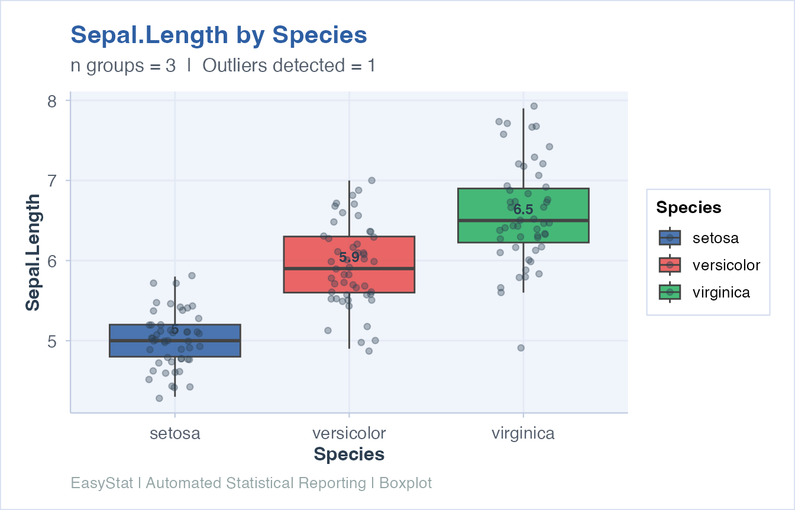
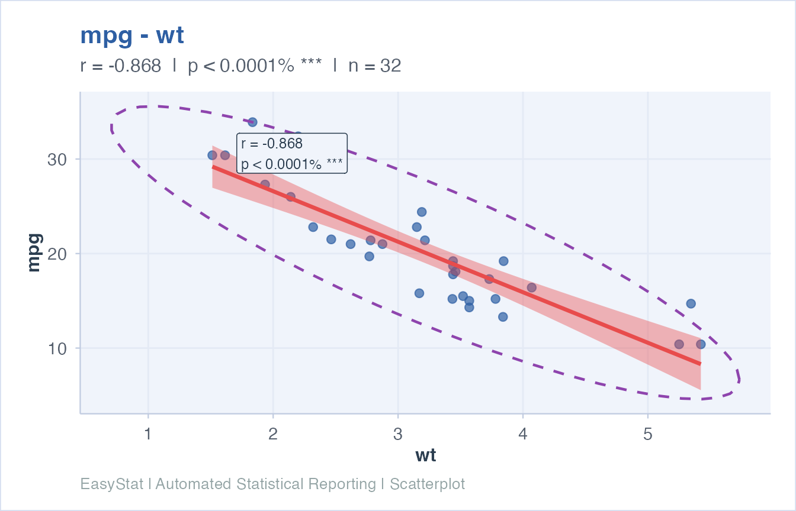
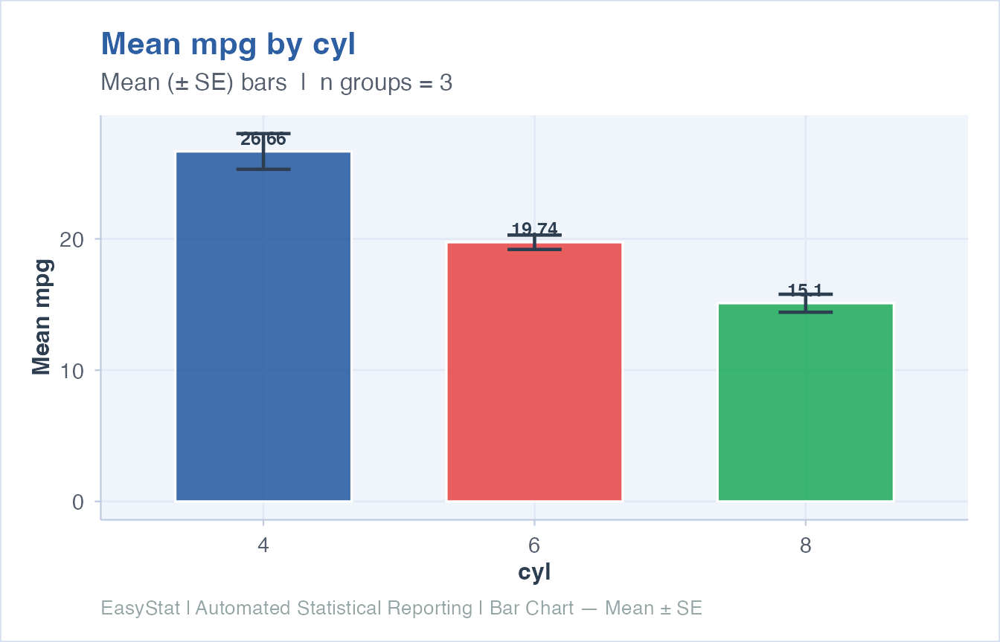
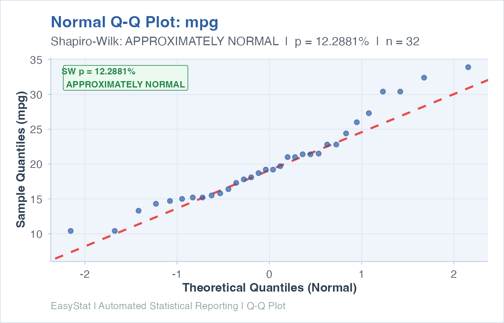
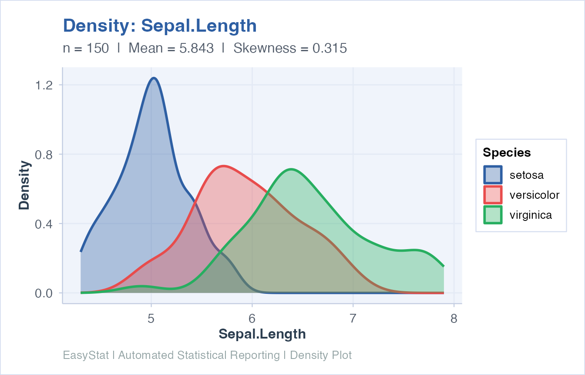
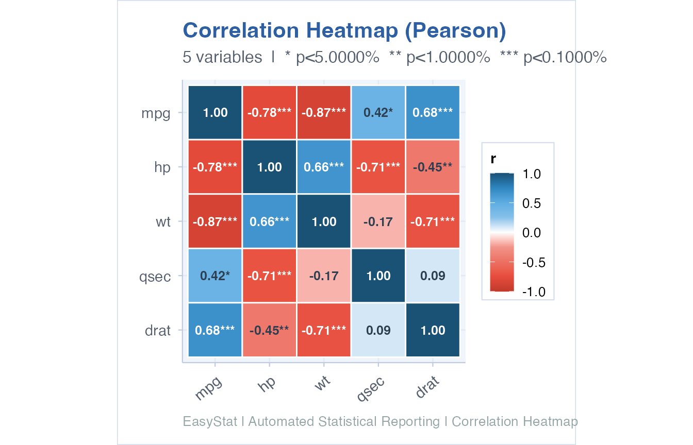

# Getting Started with EasyStat

## Overview

**EasyStat** implements a four-step pipeline that transforms raw data
into publication-ready statistical output with a single function call:

1.  **Core Statistical Engine** — wraps base-R `stats` functions (`lm`,
    `t.test`, `aov`, etc.)
2.  **Metric Extractor** — uses
    [`broom::tidy()`](https://generics.r-lib.org/reference/tidy.html) /
    [`broom::glance()`](https://generics.r-lib.org/reference/glance.html)
    to extract key values (p-value, effect size, CIs, df)
3.  **Narrative Generator Module** — applies conditional logic to
    produce a statistically sound, plain-language interpretation
4.  **Unified Result Object** — returns an `easystat_result` S3 object
    that prints as HTML in RStudio Viewer or as ASCII in the console,
    and can be exported to Word

------------------------------------------------------------------------

## Descriptive Statistics

### Single variable

``` r
result <- easy_describe(mtcars$mpg)
print(result, viewer = FALSE)
#> 
#> ================================================================================
#>  EasyStat Result :: DESCRIBE
#> ================================================================================
#> 
#> TABLE 1 — MAIN RESULTS
#> --------------------------------------------------------------------------------
#>    Variable  N Missing    Mean Median Mode     SD     SE Variance  Min     Q1
#>  mtcars$mpg 32       0 20.0906   19.2   21 6.0269 1.0654  36.3241 10.4 15.425
#>    Q3  Max Range   IQR  CV_pct Skewness Kurtosis CI_lower CI_upper Shapiro_p
#>  22.8 33.9  23.5 7.375 29.9988   0.6724   -0.022  17.9177  22.2636  12.2881%
#> 
#> TABLE 2 — MODEL FIT / SUMMARY
#> --------------------------------------------------------------------------------
#>    Variable                   Shape
#>  mtcars$mpg moderately right-skewed
#>                                                                 Kurtosis
#>  approximately mesokurtic (similar tail weight to a normal distribution)
#>                                         Normality Shapiro_p
#>  approximately normal (Shapiro-Wilk p = 12.2881%)  12.2881%
#> 
#> ================================================================================
#>  PLAIN-LANGUAGE INTERPRETATION
#> ================================================================================
#> 
#> DESCRIPTIVE STATISTICS: mtcars$mpg
#> 
#> The variable 'mtcars$mpg' has 32 valid observations (missing: 0). The central
#>   tendency is characterised by a mean of 20.0906 and a median of 19.2, with a
#>   standard deviation of 6.0269. Values range from 10.4 to 33.9 (range = 23.5;
#>   IQR = 7.375). The distribution is moderately right-skewed and approximately
#>   mesokurtic (similar tail weight to a normal distribution). Based on the
#>   Shapiro-Wilk test, the data are approximately normal (Shapiro-Wilk p =
#>   12.2881%). The coefficient of variation is 30%, indicating moderate
#>   relative variability. The 95% confidence interval for the population mean
#>   is [17.9177, 22.2636].
#> 
#> ================================================================================
```

### Multiple variables from a data frame

``` r
result <- easy_describe(mtcars, vars = c("mpg", "hp", "wt"))
print(result, viewer = FALSE)
#> 
#> ================================================================================
#>  EasyStat Result :: DESCRIBE
#> ================================================================================
#> 
#> TABLE 1 — MAIN RESULTS
#> --------------------------------------------------------------------------------
#>  Variable  N Missing     Mean  Median   Mode      SD      SE  Variance    Min
#>       mpg 32       0  20.0906  19.200  21.00  6.0269  1.0654   36.3241 10.400
#>        hp 32       0 146.6875 123.000 110.00 68.5629 12.1203 4700.8669 52.000
#>        wt 32       0   3.2172   3.325   3.44  0.9785  0.1730    0.9574  1.513
#>       Q1     Q3     Max   Range     IQR  CV_pct Skewness Kurtosis CI_lower
#>  15.4250  22.80  33.900  23.500  7.3750 29.9988   0.6724  -0.0220  17.9177
#>  96.5000 180.00 335.000 283.000 83.5000 46.7408   0.7994   0.2752 121.9679
#>   2.5812   3.61   5.424   3.911  1.0288 30.4129   0.4659   0.4166   2.8645
#>  CI_upper Shapiro_p
#>   22.2636  12.2881%
#>  171.4071   4.8808%
#>    3.5700   9.2655%
#> 
#> TABLE 2 — MODEL FIT / SUMMARY
#> --------------------------------------------------------------------------------
#>  Variable                   Shape
#>       mpg moderately right-skewed
#>        hp moderately right-skewed
#>        wt approximately symmetric
#>                                                                 Kurtosis
#>  approximately mesokurtic (similar tail weight to a normal distribution)
#>  approximately mesokurtic (similar tail weight to a normal distribution)
#>  approximately mesokurtic (similar tail weight to a normal distribution)
#>                                         Normality Shapiro_p
#>  approximately normal (Shapiro-Wilk p = 12.2881%)  12.2881%
#>             non-normal (Shapiro-Wilk p = 4.8808%)   4.8808%
#>   approximately normal (Shapiro-Wilk p = 9.2655%)   9.2655%
#> 
#> ================================================================================
#>  PLAIN-LANGUAGE INTERPRETATION
#> ================================================================================
#> 
#> DESCRIPTIVE STATISTICS: mpg
#> 
#> The variable 'mpg' has 32 valid observations (missing: 0). The central
#>   tendency is characterised by a mean of 20.0906 and a median of 19.2, with a
#>   standard deviation of 6.0269. Values range from 10.4 to 33.9 (range = 23.5;
#>   IQR = 7.375). The distribution is moderately right-skewed and approximately
#>   mesokurtic (similar tail weight to a normal distribution). Based on the
#>   Shapiro-Wilk test, the data are approximately normal (Shapiro-Wilk p =
#>   12.2881%). The coefficient of variation is 30%, indicating moderate
#>   relative variability. The 95% confidence interval for the population mean
#>   is [17.9177, 22.2636].
#> 
#> ---
#> 
#> DESCRIPTIVE STATISTICS: hp
#> 
#> The variable 'hp' has 32 valid observations (missing: 0). The central
#>   tendency is characterised by a mean of 146.6875 and a median of 123, with a
#>   standard deviation of 68.5629. Values range from 52 to 335 (range = 283;
#>   IQR = 83.5). The distribution is moderately right-skewed and approximately
#>   mesokurtic (similar tail weight to a normal distribution). Based on the
#>   Shapiro-Wilk test, the data are non-normal (Shapiro-Wilk p = 4.8808%). The
#>   coefficient of variation is 46.7%, indicating high relative variability.
#>   The 95% confidence interval for the population mean is [121.9679,
#>   171.4071].
#> 
#> ---
#> 
#> DESCRIPTIVE STATISTICS: wt
#> 
#> The variable 'wt' has 32 valid observations (missing: 0). The central
#>   tendency is characterised by a mean of 3.2172 and a median of 3.325, with a
#>   standard deviation of 0.9785. Values range from 1.513 to 5.424 (range =
#>   3.911; IQR = 1.0288). The distribution is approximately symmetric and
#>   approximately mesokurtic (similar tail weight to a normal distribution).
#>   Based on the Shapiro-Wilk test, the data are approximately normal
#>   (Shapiro-Wilk p = 9.2655%). The coefficient of variation is 30.4%,
#>   indicating high relative variability. The 95% confidence interval for the
#>   population mean is [2.8645, 3.57].
#> 
#> ================================================================================
```

### Group summaries

``` r
result <- easy_group_summary(mpg ~ cyl, data = mtcars)
print(result, viewer = FALSE)
#> 
#> ================================================================================
#>  EasyStat Result :: GROUP_SUMMARY
#> ================================================================================
#> 
#> TABLE 1 — MAIN RESULTS
#> --------------------------------------------------------------------------------
#>  Group  N    Mean Median     SD     SE  Min  Max  IQR  CV_pct Skewness CI_lower
#>      6  7 19.7429   19.7 1.4536 0.5494 17.8 21.4 2.35  7.3625  -0.2586  18.3985
#>      4 11 26.6636   26.0 4.5098 1.3598 21.4 33.9 7.60 16.9138   0.3485  23.6339
#>      8 14 15.1000   15.2 2.5600 0.6842 10.4 19.2 1.85 16.9540  -0.4558  13.6219
#>  CI_upper
#>   21.0872
#>   29.6934
#>   16.5781
#> 
#> TABLE 2 — MODEL FIT / SUMMARY
#> --------------------------------------------------------------------------------
#>             Metric   Value
#>   Outcome variable     mpg
#>  Grouping variable     cyl
#>   Number of groups       3
#>       Overall Mean 20.0906
#>         Overall SD  6.0269
#>     Overall Median    19.2
#> 
#> ================================================================================
#>  PLAIN-LANGUAGE INTERPRETATION
#> ================================================================================
#> 
#> GROUP SUMMARY: mpg by cyl
#> 
#> Descriptive statistics were computed for 'mpg' across 3 groups of 'cyl'. The
#>   group with the highest mean is '4' (M = 26.6636), while the group with the
#>   lowest mean is '8' (M = 15.1). The group with the greatest variability
#>   (highest SD) is '4' (SD = 4.5098). Overall, the grand mean across all
#>   groups is 20.0906 (SD = 6.0269, Median = 19.2). These group-level
#>   statistics provide the foundation for inferential comparisons using ANOVA
#>   or t-tests.
#> 
#> ================================================================================
```

------------------------------------------------------------------------

## Inferential Tests

### Linear Regression

``` r
result <- easy_regression(mpg ~ wt + hp, data = mtcars)
print(result, viewer = FALSE)
#> 
#> ================================================================================
#>  EasyStat Result :: REGRESSION
#> ================================================================================
#> 
#> TABLE 1 — MAIN RESULTS
#> --------------------------------------------------------------------------------
#>         Term Estimate Std. Error t Statistic  p-value
#>  (Intercept)  37.2273     1.5988     23.2847 <0.0001%
#>           wt  -3.8778     0.6327     -6.1287  0.0001%
#>           hp  -0.0318     0.0090     -3.5187  0.1451%
#> 
#> TABLE 2 — MODEL FIT / SUMMARY
#> --------------------------------------------------------------------------------
#>              Metric    Value
#>           R-squared 0.826785
#>  Adjusted R-squared  0.81484
#>         F-statistic  69.2112
#>            Model df        2
#>         Residual df       29
#>     Overall p-value <0.0001%
#> 
#> TABLE 3 — REGRESSION ANOVA TABLE
#> --------------------------------------------------------------------------------
#>       Term Df   Sum_Sq  Mean_Sq  F_value  p_value
#>         wt  1 847.7252 847.7252 126.0411 <0.0001%
#>         hp  1  83.2742  83.2742  12.3813  0.1451%
#>  Residuals 29 195.0478   6.7258       NA       NA
#> 
#> TABLE 4 — REGRESSION DIAGNOSTICS
#> --------------------------------------------------------------------------------
#>                   Metric   Value
#>                   N used      32
#>                     RMSE  2.4689
#>                      MAE  1.9015
#>              Residual SD  2.5084
#>            Mean residual       0
#>  Shapiro-Wilk residual p 3.4275%
#>  Durbin-Watson statistic  1.3624
#> 
#> TABLE 5 — INFLUENTIAL OBSERVATIONS
#> --------------------------------------------------------------------------------
#>  Observation Cook_Distance Leverage Std_Residual Influential
#>           17      0.423611 0.186487       2.3545         Yes
#>           31      0.272040 0.394208       1.1199         Yes
#>           20      0.208393 0.099503       2.3786         Yes
#>           18      0.157426 0.079910       2.3319         Yes
#>           28      0.073540 0.153641       1.1024          No
#> 
#> ================================================================================
#>  PLAIN-LANGUAGE INTERPRETATION
#> ================================================================================
#> 
#> LINEAR REGRESSION ANALYSIS Formula: mpg ~ wt + hp
#> 
#> The overall regression model is highly statistically significant (p <
#>   0.0001%), indicating that the set of 2 predictor(s) collectively explains a
#>   meaningful portion of the variance in the outcome variable (F(2, 29) =
#>   69.211). The model accounts for 82.7% (large effect) of the total variance
#>   in the response variable (Adjusted R² = 81.5%). The intercept is estimated
#>   at 37.2273, representing the predicted value of the outcome when all
#>   predictors equal zero (highly statistically significant (p < 0.0001%)). The
#>   predictor 'wt' is associated with a decrease of 3.8778 in the outcome for
#>   each one-unit increase, and this effect is highly statistically significant
#>   (p = 0.0001%). The predictor 'hp' is associated with a decrease of 0.0318
#>   in the outcome for each one-unit increase, and this effect is statistically
#>   significant (p = 0.1451%). Overall, the model provides statistically
#>   meaningful insight and may be suitable for predictive or inferential
#>   purposes.
#> 
#> ================================================================================
```

### Independent Samples t-Test

``` r
result <- easy_ttest(mpg ~ am, data = mtcars)
print(result, viewer = FALSE)
#> 
#> ================================================================================
#>  EasyStat Result :: TTEST
#> ================================================================================
#> 
#> TABLE 1 — MAIN RESULTS
#> --------------------------------------------------------------------------------
#>          Metric Label    Value
#>  Mean (Group 1)     0  17.1474
#>  Mean (Group 2)     1  24.3923
#>  95% CI (lower)     - -11.2802
#>  95% CI (upper)     -  -3.2097
#> 
#> TABLE 2 — MODEL FIT / SUMMARY
#> --------------------------------------------------------------------------------
#>              Metric   Value
#>         t-statistic -3.7671
#>  Degrees of Freedom   18.33
#>             p-value 0.1374%
#> 
#> ================================================================================
#>  PLAIN-LANGUAGE INTERPRETATION
#> ================================================================================
#> 
#> INDEPENDENT-SAMPLES t-TEST Comparison: mpg ~ am
#> 
#> An independent-samples t-test revealed a statistically significant (p =
#>   0.1374%) difference between the two groups (t(18.33) = -3.767). The mean
#>   for '0' was 17.1474 and the mean for '1' was 24.3923. The 95% confidence
#>   interval for the difference in means ranged from -11.2802 to -3.2097. These
#>   results provide statistically significant evidence that '0' and '1' differ
#>   meaningfully on the measured variable.
#> 
#> ================================================================================
```

### One-Way ANOVA

``` r
result <- easy_anova(Sepal.Length ~ Species, data = iris)
print(result, viewer = FALSE)
#> 
#> ================================================================================
#>  EasyStat Result :: ANOVA
#> ================================================================================
#> 
#> TABLE 1 — MAIN RESULTS
#> --------------------------------------------------------------------------------
#>     Source  df Sum of Squares Mean Square F Statistic  p-value
#>    Species   2        63.2121     31.6061    119.2645 <0.0001%
#>  Residuals 147        38.9562      0.2650          NA       NA
#> 
#> TABLE 2 — MODEL FIT / SUMMARY
#> --------------------------------------------------------------------------------
#>            Metric    Value
#>       F-statistic 119.2645
#>          Group df        2
#>       Residual df      147
#>   Overall p-value <0.0001%
#>  Eta-squared (η²)   0.6187
#> 
#> TABLE 3 — GROUP DESCRIPTIVES
#> --------------------------------------------------------------------------------
#>       Group  N  Mean     SD     SE CI_Lower CI_Upper
#>      setosa 50 5.006 0.3525 0.0498   4.9058   5.1062
#>  versicolor 50 5.936 0.5162 0.0730   5.7893   6.0827
#>   virginica 50 6.588 0.6359 0.0899   6.4073   6.7687
#> 
#> TABLE 4 — ASSUMPTION CHECKS
#> --------------------------------------------------------------------------------
#>                              Check                                 Result
#>  Residual normality (Shapiro-Wilk)                               21.8864%
#>         Equal variances (Bartlett)                                0.0335%
#>              Recommended next step Consider Welch ANOVA or Kruskal-Wallis
#> 
#> TABLE 5 — TUKEY POST-HOC COMPARISONS
#> --------------------------------------------------------------------------------
#>            Comparison Difference CI_Lower CI_Upper Adj_p_value Significant
#>     versicolor-setosa      0.930   0.6862   1.1738    <0.0001%         Yes
#>      virginica-setosa      1.582   1.3382   1.8258    <0.0001%         Yes
#>  virginica-versicolor      0.652   0.4082   0.8958    <0.0001%         Yes
#> 
#> ================================================================================
#>  PLAIN-LANGUAGE INTERPRETATION
#> ================================================================================
#> 
#> ONE-WAY ANOVA Formula: Sepal.Length ~ Species
#> 
#> A one-way ANOVA revealed a highly statistically significant (p < 0.0001%)
#>   difference across the 3 groups (F(2, 147) = 119.265). The effect size
#>   (eta-squared = 0.6187) indicates a large practical significance of the
#>   group factor, meaning the grouping variable accounts for approximately
#>   61.9% of the total variance in the outcome. Post-hoc tests (e.g., Tukey
#>   HSD) are recommended to determine which specific group pairs differ
#>   significantly.
#> 
#> ================================================================================
```

### Chi-Square Test of Independence

``` r
result <- easy_chisq(~ cyl + am, data = mtcars)
#> Warning in stats::chisq.test(tbl, correct = correct): Chi-squared approximation
#> may be incorrect
print(result, viewer = FALSE)
#> 
#> ================================================================================
#>  EasyStat Result :: CHISQ
#> ================================================================================
#> 
#> TABLE 1 — MAIN RESULTS
#> --------------------------------------------------------------------------------
#>  Category Observed Expected Residual Std_Residual
#>     4 | 0        3     6.53  -3.5312      -1.3818
#>     4 | 1        4     4.16  -0.1562      -0.0766
#>     6 | 0       12     8.31   3.6875       1.2790
#>     6 | 1        8     4.47   3.5312       1.6705
#>     8 | 0        3     2.84   0.1562       0.0927
#>     8 | 1        2     5.69  -3.6875      -1.5462
#> 
#> TABLE 2 — MODEL FIT / SUMMARY
#> --------------------------------------------------------------------------------
#>                     Metric       Value
#>  Chi-square statistic (χ²)      8.7407
#>         Degrees of Freedom           2
#>                    p-value     1.2647%
#>                  N (total)          32
#>                 Cramér's V      0.5226
#>            Effect Strength very strong
#> 
#> TABLE 3 — OBSERVED CONTINGENCY TABLE
#> --------------------------------------------------------------------------------
#>  Category  0 1
#>         4  3 8
#>         6  4 3
#>         8 12 2
#> 
#> TABLE 4 — EXPECTED COUNTS
#> --------------------------------------------------------------------------------
#>  Category      0      1
#>         4 6.5312 4.4688
#>         6 4.1562 2.8438
#>         8 8.3125 5.6875
#> 
#> TABLE 5 — ROW PERCENTAGES
#> --------------------------------------------------------------------------------
#>  Category       0       1
#>         4 27.2727 72.7273
#>         6 57.1429 42.8571
#>         8 85.7143 14.2857
#> 
#> TABLE 6 — COLUMN PERCENTAGES
#> --------------------------------------------------------------------------------
#>  Category       0       1
#>         4 15.7895 61.5385
#>         6 21.0526 23.0769
#>         8 63.1579 15.3846
#> 
#> TABLE 7 — TOTAL PERCENTAGES
#> --------------------------------------------------------------------------------
#>  Category      0      1
#>         4  9.375 25.000
#>         6 12.500  9.375
#>         8 37.500  6.250
#> 
#> ================================================================================
#>  PLAIN-LANGUAGE INTERPRETATION
#> ================================================================================
#> 
#> CHI-SQUARE TEST OF INDEPENDENCE
#> 
#> A Pearson chi-square test of independence revealed a statistically
#>   significant (p = 1.2647%) association between 'cyl' and 'am' (χ²(2) =
#>   8.741). The effect size, measured by Cramér's V = 0.5226, indicates a very
#>   strong practical association between the two categorical variables. The
#>   observed cell frequencies deviate meaningfully from what would be expected
#>   under statistical independence, suggesting a genuine relationship between
#>   'cyl' and 'am'.
#> 
#> ================================================================================
```

### F-Test for Equality of Variances

``` r
result <- easy_ftest(mpg ~ am, data = mtcars)
#> Multiple parameters; naming those columns num.df and den.df.
print(result, viewer = FALSE)
#> 
#> ================================================================================
#>  EasyStat Result :: FTEST
#> ================================================================================
#> 
#> TABLE 1 — MAIN RESULTS
#> --------------------------------------------------------------------------------
#>                Metric     Value
#>          Variance — 0 14.699298
#>          Variance — 1 38.025769
#>                SD — 0  3.833966
#>                SD — 1  6.166504
#>                 n — 0 19.000000
#>                 n — 1 13.000000
#>    Variance Ratio (F)  0.386561
#>  95% CI lower (ratio)  0.124372
#>  95% CI upper (ratio)  1.070343
#> 
#> TABLE 2 — MODEL FIT / SUMMARY
#> --------------------------------------------------------------------------------
#>          Metric               Value
#>     F-statistic              0.3866
#>    Numerator df                  18
#>  Denominator df                  12
#>         p-value             6.6906%
#>     Alternative           two.sided
#>      Conclusion Variances are EQUAL
#> 
#> ================================================================================
#>  PLAIN-LANGUAGE INTERPRETATION
#> ================================================================================
#> 
#> F-TEST FOR EQUALITY OF VARIANCES Comparison: mpg ~ am
#> 
#> An F-test for equality of variances found not statistically significant (p =
#>   6.6906%) evidence of a difference in variance between the two groups (F(18,
#>   12) = 0.3866). The ratio of variances is 0.3866. The 95% CI for the
#>   variance ratio is [0.1244, 1.0703]. IMPLICATION: The assumption of equal
#>   variances (homoscedasticity) is SUPPORTED. Both the classical t-test and
#>   Welch's t-test are appropriate.
#> 
#> ================================================================================
```

### Correlation Analysis

``` r
result <- easy_correlation(~ mpg + wt, data = mtcars)
print(result, viewer = FALSE)
#> 
#> ================================================================================
#>  EasyStat Result :: CORRELATION
#> ================================================================================
#> 
#> TABLE 1 — MAIN RESULTS
#> --------------------------------------------------------------------------------
#>                  Metric     Value
#>             r (Pearson) -0.867659
#>  r² (shared variance %)    75.28%
#>            95% CI lower -0.933826
#>            95% CI upper -0.744087
#>             t-statistic    -9.559
#>         n (valid pairs)        32
#>        Regression slope -0.140862
#>    Regression intercept  6.047255
#> 
#> TABLE 2 — MODEL FIT / SUMMARY
#> --------------------------------------------------------------------------------
#>                Metric            Value
#>               p-value         <0.0001%
#>  Correlation strength           strong
#>             Direction         Negative
#>     Effect size class large (d ≥ 0.80)
#> 
#> ================================================================================
#>  PLAIN-LANGUAGE INTERPRETATION
#> ================================================================================
#> 
#> CORRELATION ANALYSIS (Pearson)
#> 
#> A Pearson correlation analysis revealed a strong negative correlation between
#>   the two variables (r = -0.8677), which is highly statistically significant
#>   (p < 0.0001%). The coefficient of determination (r² = 0.7528) indicates
#>   that approximately 75.3% of the variance in one variable is shared with the
#>   other. The 95% confidence interval for the correlation coefficient is
#>   [-0.9338, -0.7441]. This strong relationship may have meaningful practical
#>   implications and warrants further investigation.
#> 
#> ================================================================================
```

#### Pairwise correlation matrix

``` r
result <- easy_correlation(mtcars, vars = c("mpg", "hp", "wt", "disp"))
print(result, viewer = FALSE)
#> 
#> ================================================================================
#>  EasyStat Result :: CORRELATION_MATRIX
#> ================================================================================
#> 
#> TABLE 1 — MAIN RESULTS
#> --------------------------------------------------------------------------------
#>  Var1 Var2       r r_squared  p_value Strength Direction Sig
#>   mpg   hp -0.7762    0.6024 <0.0001%   strong  Negative Yes
#>   mpg   wt -0.8677    0.7528 <0.0001%   strong  Negative Yes
#>   mpg disp -0.8476    0.7183 <0.0001%   strong  Negative Yes
#>    hp   wt  0.6587    0.4339  0.0041% moderate  Positive Yes
#>    hp disp  0.7909    0.6256 <0.0001%   strong  Positive Yes
#>    wt disp  0.8880    0.7885 <0.0001%   strong  Positive Yes
#> 
#> TABLE 2 — MODEL FIT / SUMMARY
#> --------------------------------------------------------------------------------
#>                 Metric   Value
#>                 Method Pearson
#>              Variables       4
#>         Pairs examined       6
#>  Strongest correlation   0.888
#>    Weakest correlation  0.6587
#>      Pairs significant       6
#> 
#> ================================================================================
#>  PLAIN-LANGUAGE INTERPRETATION
#> ================================================================================
#> 
#> CORRELATION HEATMAP INTERPRETATION
#> 
#> The heatmap displays pairwise pearson correlations among 4 variables. Cell
#>   colour intensity reflects the strength of association: dark blue = strong
#>   positive, dark red = strong negative, white = no correlation. Among the 6
#>   pairs examined, 5 show strong correlations (|r| ≥ 0.70) and 1 show moderate
#>   correlations (0.30 ≤ |r| < 0.70). Diagonal values are 1.0 by definition
#>   (each variable correlates perfectly with itself).
#> 
#> ================================================================================
```

------------------------------------------------------------------------

## Visualizations

All plot functions return an `easystat_result` object. Access the
ggplot2 object via `result$plot_object` and the plain-language narrative
via `result$explanation`.

### Histogram

``` r
p <- easy_histogram("mpg", data = mtcars)
p$plot_object
```



### Grouped Box Plot

``` r
p <- easy_boxplot(Sepal.Length ~ Species, data = iris)
p$plot_object
```



### Scatter Plot with Regression Line

``` r
p <- easy_scatter(mpg ~ wt, data = mtcars)
p$plot_object
```



### Bar Chart (mean +/- SE)

``` r
p <- easy_barplot("mpg", data = mtcars, group_by = "cyl", stat = "mean")
p$plot_object
```



### Q-Q Plot

``` r
p <- easy_qqplot("mpg", data = mtcars)
p$plot_object
```



### Density Plot

``` r
p <- easy_density("Sepal.Length", data = iris, group_by = "Species")
p$plot_object
```



### Correlation Heatmap

``` r
p <- easy_correlation_heatmap(mtcars, vars = c("mpg", "hp", "wt", "qsec", "drat"))
p$plot_object
```



------------------------------------------------------------------------

## Export to Microsoft Word

[`export_to_word()`](https://EasyStat.github.io/EasyStat/reference/export_to_word.md)
creates a formatted `.docx` report with the result narrative and tables.

``` r
reg_result <- easy_regression(mpg ~ wt + hp, data = mtcars)

export_to_word(
  reg_result,
  file   = "MyReport.docx",
  title  = "Fuel Economy Analysis",
  author = "Mahesh Divakaran, Gunjan Singh, Jayadevan Shreedharan"
)
```

------------------------------------------------------------------------

## The `easystat_result` Object

Every EasyStat function returns a list with class `"easystat_result"`:

| Field | Contents |
|----|----|
| `test_type` | Character identifier (e.g. `"regression"`, `"ttest"`) |
| `formula_str` | Formula or label used |
| `raw_model` | The underlying R model object (`lm`, `htest`, etc.) |
| `coefficients_table` | `data.frame` of parameter estimates |
| `model_fit_table` | `data.frame` of fit / summary statistics |
| `explanation` | Plain-language narrative string |
| `plot_object` | ggplot2 object (visualization functions only) |

You can access any field directly:

``` r
result <- easy_ttest(mpg ~ am, data = mtcars)
cat(result$explanation)
#> INDEPENDENT-SAMPLES t-TEST
#> Comparison: mpg ~ am
#> 
#> An independent-samples t-test revealed a statistically significant (p = 0.1374%) difference between the two groups (t(18.33) = -3.767). The mean for '0' was 17.1474 and the mean for '1' was 24.3923. The 95% confidence interval for the difference in means ranged from -11.2802 to -3.2097. These results provide statistically significant evidence that '0' and '1' differ meaningfully on the measured variable.
```
